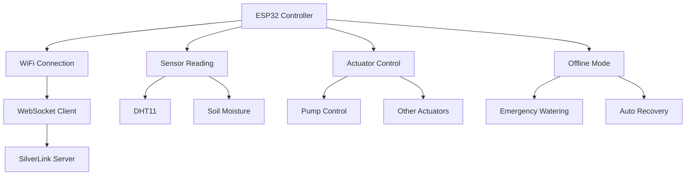

# 🌱 SilverLink ESP32 IoT Controller

<div align="center">


**🚀 Advanced IoT Controller for Smart Agriculture with WebSocket Communication & Offline Mode**

*Created with ❤️ for Silver Wolf*

[Features](#-features) • [Installation](#-installation) • [Configuration](#-configuration) • [API](#-api-documentation) • [Contributing](#-contributing)

</div>

---

## 📋 Table of Contents

- [🎯 Overview](#-overview)
- [✨ Features](#-features)
- [🔧 Hardware Requirements](#-hardware-requirements)
- [📦 Installation](#-installation)
- [⚙️ Configuration](#-configuration)
- [🌐 System Architecture](#-system-architecture)
- [📡 Communication Protocol](#-communication-protocol)
- [🔴 Offline Mode](#-offline-mode)
- [📊 Sensor Support](#-sensor-support)
- [⚡ Actuator Control](#-actuator-control)
- [🛠️ Troubleshooting](#-troubleshooting)
- [📈 Monitoring](#-monitoring)
- [🤝 Contributing](#-contributing)
- [📄 License](#-license)

## 🎯 Overview

SilverLink ESP32 IoT Controller is a robust, production-ready IoT system designed for smart agriculture applications. It features real-time sensor monitoring, remote actuator control, and intelligent offline operation with emergency response capabilities.

### 🌟 Key Highlights

- **🔄 Real-time WebSocket Communication** with auto-reconnection
- **🔴 Intelligent Offline Mode** with emergency plant watering
- **📱 Easy Web-based Setup** via captive portal
- **🌡️ Multi-sensor Support** (DHT11, Soil Moisture, etc.)
- **⚡ Remote Actuator Control** via WebSocket commands
- **💾 Dynamic Runtime Configuration** without firmware updates
- **🔋 System Health Monitoring** with auto-recovery
- **🛡️ Robust Error Handling** and fail-safe mechanisms

## ✨ Features

### 🌐 Connectivity
- **WiFi Management** with auto-reconnection
- **WebSocket Client** for real-time server communication
- **Captive Portal Setup** for easy configuration
- **Heartbeat System** for connection monitoring

### 📊 Sensor Integration
- **DHT11** Temperature & Humidity sensor
- **Soil Moisture** with calibrated readings (0-100%)
- **Voltage Monitoring** for power supply status
- **Expandable Architecture** for additional sensors

### ⚡ Actuator Control
- **Remote GPIO Control** via WebSocket commands
- **Emergency Pump Control** in offline mode
- **State Management** and logging
- **Safety Mechanisms** and validation

### 🔴 Offline Intelligence
- **Autonomous Operation** when disconnected
- **Emergency Plant Watering** based on soil moisture thresholds
- **Sensor Monitoring** continues in offline mode
- **Auto-recovery** after connection restored

### 🛡️ System Reliability
- **Memory Management** with low-memory protection
- **Error Counting** and automatic restart
- **Configuration Backup** in LittleFS
- **Comprehensive Logging** for debugging

## 🔧 Hardware Requirements

### 📱 Core Components
| Component | Specification | Purpose |
|-----------|---------------|---------|
| **ESP32** | Any ESP32 dev board | Main controller |
| **DHT11** | Temperature/Humidity sensor | Environmental monitoring |
| **Soil Moisture Sensor** | Analog/Capacitive | Plant monitoring |
| **Relay Module** | 5V/12V compatible | Pump/actuator control |
| **Reset Button** | Pull-up button | Factory reset |

### 🔌 Pin Configuration
```cpp
#define RESET_PIN 4        // Factory reset button
#define SENSOR_PIN 34      // Soil moisture sensor (ADC)
#define VOLTAGE_PIN 35     // Power monitoring (optional)
// DHT11 and actuators: Configurable via runtime config
```

### ⚡ Power Requirements
- **Voltage**: 3.3V - 5V DC
- **Current**: ~200mA (without actuators)
- **Backup Power**: Recommended for continuous operation

## 📦 Installation

### 1️⃣ Arduino IDE Setup
```bash
# Install ESP32 board package
# Tools -> Board -> Board Manager -> ESP32

# Install required libraries:
- WiFi (built-in)
- ESPAsyncWebServer
- LittleFS (built-in)
- ArduinoJson
- WebSocketsClient
- DHT sensor library
```

### 2️⃣ Library Dependencies
```cpp
#include <WiFi.h>
#include <ESPAsyncWebServer.h>
#include <LittleFS.h>
#include <ArduinoJson.h>
#include <WebSocketsClient.h>
#include <DHT.h>
```

### 3️⃣ Upload Process
1. **Connect ESP32** to your computer
2. **Select Board**: ESP32 Dev Module
3. **Set Parameters**:
   - Upload Speed: 921600
   - Flash Frequency: 80MHz
   - Partition Scheme: Default 4MB
4. **Upload Code** and monitor serial output

## ⚙️ Configuration

### 🔧 Initial Setup (First Time)

1. **Power on ESP32** - LED should indicate setup mode
2. **Connect to WiFi**: `SilverLink-Setup` (password: `silverlink123`)
3. **Open Browser**: Navigate to `192.168.4.1`
4. **Configure**:
   - Select your WiFi network
   - Enter WiFi password
   - Input SilverLink device token
5. **Save & Restart** - Device will connect to your network

### 📋 Runtime Configuration

The system supports dynamic sensor/actuator configuration via WebSocket:

```json
{
  "event": "runtime_config",
  "sensors": [
    {
      "type": "dht11",
      "pin": 16
    },
    {
      "type": "soil_moisture", 
      "pin": 34,
      "threshold": 30
    }
  ],
  "aktuators": [
    {
      "function": "pump",
      "pin": 12
    }
  ]
}
```

### 🔄 Factory Reset
- **Hold reset button** during power-on
- All configurations will be cleared
- Device returns to setup mode

## 🌐 System Architecture



## 📡 Communication Protocol

### 🔐 Authentication
```json
{
  "event": "auth",
  "token": "your-device-token"
}
```

### 📤 Sensor Data
```json
{
  "event": "sensor_data",
  "token": "device-token",
  "data": [
    {
      "type": "dht_temperature",
      "pin": 16,
      "value": 25.6
    },
    {
      "type": "soil_moisture", 
      "pin": 34,
      "value": 45.2
    }
  ]
}
```

### ⚡ Actuator Control
```json
{
  "event": "set_aktuator",
  "pin": 12,
  "state": true
}
```

### 💓 Heartbeat
```json
{
  "event": "heartbeat",
  "token": "device-token",
  "uptime": 3600,
  "free_memory": 45000,
  "wifi_rssi": -45,
  "sensor_count": 3,
  "actuator_count": 1
}
```

## 🔴 Offline Mode

### 🎯 Trigger Conditions
- **OFFLINE_WIFI**: WiFi connection lost → 30 minutes offline
- **OFFLINE_SERVER**: Server connection failed 5+ times → 6 hours offline

### 🚨 Emergency Features
- **Soil Moisture Monitoring**: Every 5 minutes
- **Automatic Pump Activation**: When moisture < threshold
- **Environmental Logging**: Temperature & humidity tracking
- **Auto Recovery**: System restart after offline period

### 📊 Offline Operation Flow
```
Offline Mode Active
├── Monitor sensors every 5 minutes
├── Check soil moisture against threshold
├── Activate pump if moisture too low
├── Log all readings to serial
└── Auto-restart when offline period ends
```

## 📊 Sensor Support

### 🌡️ DHT11 (Temperature & Humidity)
```cpp
// Automatic configuration for both temp and humidity
{
  "type": "dht11",
  "pin": 16  // Any digital pin
}
```

### 🌱 Soil Moisture
```cpp
// Calibrated 0-100% reading
{
  "type": "soil_moisture",
  "pin": 34,        // ADC pin (32-39)
  "threshold": 30   // Emergency watering level
}
```

### 🔋 Voltage Monitoring (Optional)
```cpp
// Power supply monitoring
#define VOLTAGE_PIN 35
// Automatically detected if voltage divider present
```

## ⚡ Actuator Control

### 💧 Pump Control
```json
{
  "function": "pump",
  "pin": 12,
  "state": true/false
}
```

### 🔌 GPIO Management
- **Pin Validation**: Ensures valid ESP32 pins
- **State Tracking**: Maintains actuator states
- **Safety Checks**: Prevents invalid operations
- **Logging**: Comprehensive action logging

## 🛠️ Troubleshooting

### 🔍 Common Issues

#### 📶 WiFi Connection Problems
```
Issue: Cannot connect to WiFi
Solution:
1. Check SSID and password
2. Ensure 2.4GHz network (ESP32 doesn't support 5GHz)
3. Check signal strength
4. Factory reset if needed
```

#### 🌐 Server Connection Issues
```
Issue: WebSocket connection fails
Solution:
1. Verify server address: silverlink.eula.my.id:5050
2. Check device token validity
3. Ensure firewall allows WebSocket connections
4. Monitor serial output for error details
```

#### 📡 Sensor Reading Problems
```
Issue: Invalid sensor readings
Solution:
1. Check wiring connections
2. Verify pin configuration
3. Ensure proper power supply
4. Calibrate soil moisture sensor
```

### 📊 Debug Information

Enable detailed logging by monitoring serial output at **115200 baud**:

```
🚀 System initialization started
📶 WiFi status: Connected (RSSI: -45 dBm)
🔗 WebSocket: Connected to server
📤 Sensor data sent: 3 sensors (245 bytes)
💓 Heartbeat: Uptime 3600s, Memory: 45KB
```

## 📈 Monitoring

### 📊 System Health Metrics
- **Uptime**: System runtime since last restart
- **Memory Usage**: Free heap monitoring with low-memory protection
- **WiFi Signal**: RSSI strength monitoring
- **Connection Status**: Real-time connectivity status
- **Error Counting**: Consecutive error tracking with auto-restart

### 🔍 Performance Indicators
- **Sensor Reading Frequency**: Every 5 seconds when online
- **Heartbeat Interval**: Every 30 seconds
- **Offline Monitoring**: Every 5 minutes
- **Auto-recovery**: Configurable timeout periods

## 🤝 Contributing

We welcome contributions! Here's how you can help:

### 🐛 Bug Reports
- Use GitHub Issues with detailed description
- Include serial output logs
- Specify hardware configuration
- Provide steps to reproduce

### 💡 Feature Requests
- Describe the use case clearly
- Explain expected behavior
- Consider backward compatibility
- Provide implementation ideas if possible

### 🔧 Pull Requests
1. Fork the repository
2. Create feature branch (`git checkout -b feature/AmazingFeature`)
3. Commit changes (`git commit -m 'Add AmazingFeature'`)
4. Push to branch (`git push origin feature/AmazingFeature`)
5. Open Pull Request

### 📝 Coding Standards
- Work on any users

## 📄 License

This project is licensed under the MIT License - see the [LICENSE](LICENSE) file for details.

## 🙏 Acknowledgments

- **ESP32 Community** for excellent documentation
- **Arduino Libraries** for robust foundations  
- **Silver Wolf** for project inspiration
- **Contributors** who help improve this project

## 📞 Support

- **Documentation**: Check this README and code comments
- **Issues**: Use GitHub Issues for bug reports
- **Discussions**: GitHub Discussions for questions
- **Email**: azharali7805@gmail.com

---

<div align="center">

**🌱 SilverLink ESP32 IoT Controller v1.3**

*Making Smart Agriculture Accessible*

[](https://github.com/username/silverlink-esp32/stargazers)
[](https://github.com/username/silverlink-esp32/network)

</div>